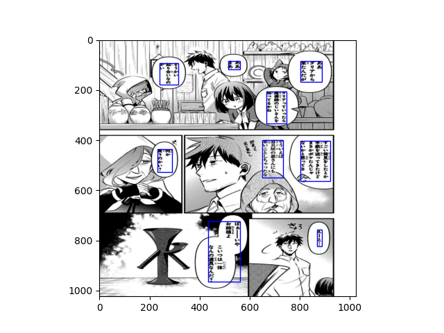
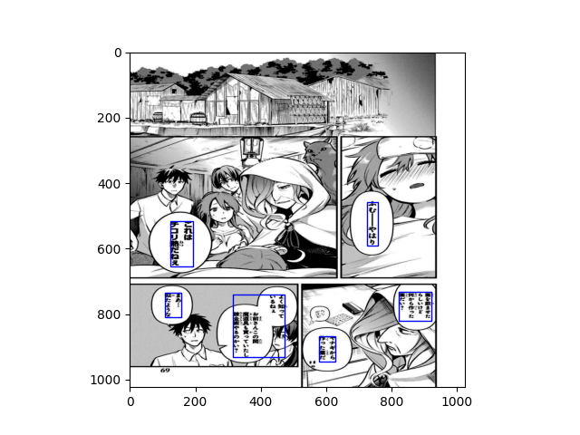
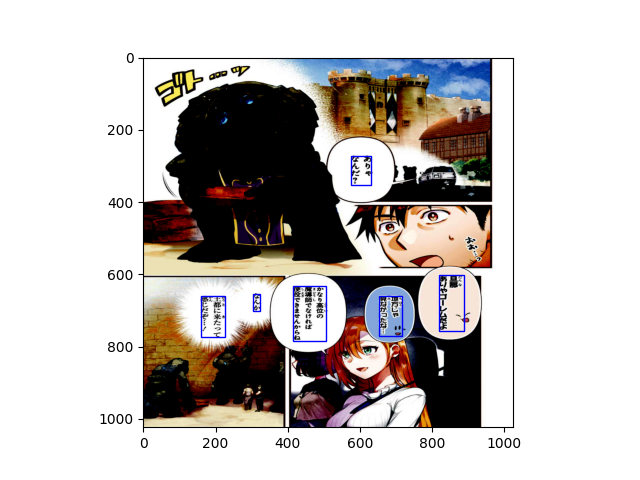

# UNet_MangaText_Segmentation

This repository contains an implementation of a **U-Net-based model** for text segmentation in manga images. The model is trained using the Hugging Face `Trainer` API and achieves high accuracy in detecting and segmenting text regions. The output masks are used to extract bounding boxes for downstream tasks like OCR (Optical Character Recognition).

## Table of Contents
1. [Overview](#overview)
2. [Model Architecture](#model-architecture)
3. [Training](#training)
4. [Inference](#inference)
5. [Sample Results](#sample-results)
6. [Usage](#usage)
7. [Acknowledgments](#acknowledgments)

---

## Overview

The goal of this project is to segment text regions in manga images using a **U-Net architecture**. The model predicts binary masks for text regions, which are then converted into bounding boxes. This pipeline can be used as a preprocessing step for OCR systems or other text-related tasks.

---

## Model Architecture

The model is based on the **U-Net architecture**, which is widely used for image segmentation tasks. Key features include:
- **Encoder**: A series of convolutional blocks with max-pooling layers to downsample the input image.
- **Bottleneck**: A central block that captures high-level features.
- **Decoder**: A series of upsampling blocks with skip connections to reconstruct the segmentation mask.
- **Output Layer**: Produces a single-channel binary mask for text regions.

The model has been optimized to reduce the number of parameters while maintaining high performance.

---

## Training

The model was trained using the Hugging Face `Trainer` API, which simplifies the training process by handling batching, logging, and evaluation.

### Training Details
- **Dataset**: Manga images with corresponding binary masks for text regions from Manga109 Dataset(Fixed image size [3,1024,1024] and mask size [1,1024,1024]).
- **Loss Function**: BCE.
- **Optimizer**: AdamW with a learning rate scheduler.
- **Batch Size**: 4 (adjustable based on GPU memory).
- **Epochs**: 10 (adjustable based on convergence).

---

## Inference

Once trained, the model can be used to predict text masks for new manga images. The predicted masks are post-processed to extract bounding boxes around text regions.

### Steps for Inference
1. Load the trained model weights.
2. Pass image path to inference function and image size as 1024 to get the predicted mask.
3. Use bounding box extraction function to identify text regions.
4. Plot the bounding boxes on the original image.

---

## Sample Results

Below are three sample images with bounding boxes plotted using the trained model:

### Sample 1

*Description: Text regions in a manga panel are accurately detected and bounded.*

### Sample 2

*Description: Multiple text regions are segmented and boxed correctly.*

### Sample 3

*Description: Fine-grained text detection in complex backgrounds.*

---
## Usage

One can integrate the text detection model with OCR focused models to automate text detection and translation. For example:
### OCR
After fetching bounded box, crop those parts and pass through an OCR model to recognize the text in it
```python
from PIL import Image
import matplotlib.pyplot as plt
from transformers import VisionEncoderDecoderModel, AutoTokenizer

tokenizer = AutoTokenizer.from_pretrained('tirthadagr8/CustomOCR')
model=VisionEncoderDecoderModel.from_pretrained('tirthadagr8/CustomOCR')
import torch
from torchvision import transforms as T
simple_transforms=T.Compose([
            T.Resize((224,224)),
            T.ToTensor(),
            T.Normalize(mean=[0.485, 0.456, 0.406], std=[0.229, 0.224, 0.225])
        ])

path="image.jpg"
img=simple_transforms(Image.open(path))
model.eval()
with torch.no_grad():
    print(tokenizer.batch_decode(model.cuda().generate(img.unsqueeze(0).cuda()),skip_special_tokens=True))

plt.imshow(Image.open(path).resize((224,224)))
```
### Translation
-> The recognized text can then be passed through a Language Model specialized for translation purposes
```python
from transformers import AutoTokenizer,AutoModelForCausalLM
tokenizer=AutoTokenizer.from_pretrained('tirthadagr8/Japanese_to_english_gpt2CasualLM_GemmaTokenizer')
model=AutoModelForCausalLM.from_pretrained('tirthadagr8/Japanese_to_english_gpt2CasualLM_GemmaTokenizer')
model.cuda()
src_text='あなたとは遊びたくない'
print(tokenizer.batch_decode(model.generate(tokenizer.encode(f"Translate the following Japanese sentence to English:\n\nJapanese:{src_text}\nEnglish:",return_tensors='pt')[:,:-1].cuda(),max_length=128))[0])
```

---

## Acknowledgments
```bibtex
@article{mtap_matsui_2017,
    author={Yusuke Matsui and Kota Ito and Yuji Aramaki and Azuma Fujimoto and Toru Ogawa and Toshihiko Yamasaki and Kiyoharu Aizawa},
    title={Sketch-based Manga Retrieval using Manga109 Dataset},
    journal={Multimedia Tools and Applications},
    volume={76},
    number={20},
    pages={21811--21838},
    doi={10.1007/s11042-016-4020-z},
    year={2017}
}
```
```bibtex
@article{multimedia_aizawa_2020,
    author={Kiyoharu Aizawa and Azuma Fujimoto and Atsushi Otsubo and Toru Ogawa and Yusuke Matsui and Koki Tsubota and Hikaru Ikuta},
    title={Building a Manga Dataset ``Manga109'' with Annotations for Multimedia Applications},
    journal={IEEE MultiMedia},
    volume={27},
    number={2},
    pages={8--18},
    doi={10.1109/mmul.2020.2987895},
    year={2020}
}
```
